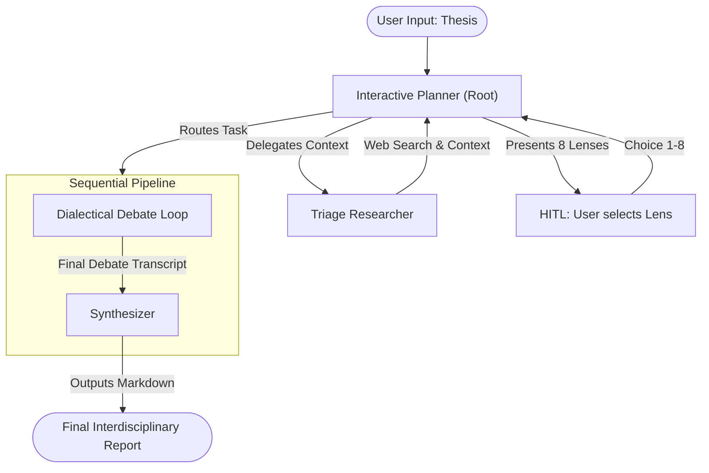
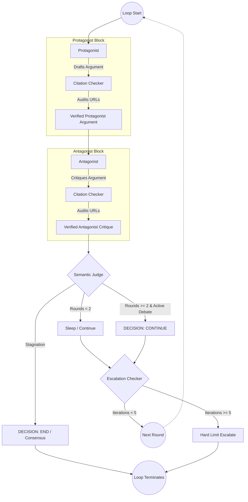
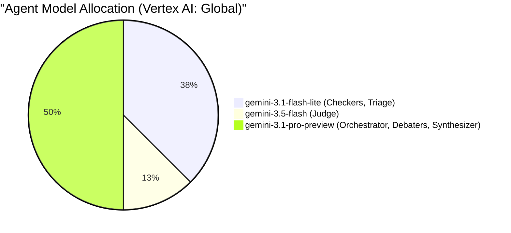

# Socratic Duel - Architecture & Workflows

## 1. High-Level Triage & Debate Pipeline

This diagram shows the end-to-end flow from the user's initial input to the final synthesized report, highlighting the Human-in-the-Loop (HITL) step.

## 2. Dialectical Debate Loop (The Engine)

This diagram details the internal mechanics of the `LoopAgent`.

## 3. Tri-Model Strategy

The backend allocates specific reasoning models based on the cognitive complexity of the task, optimizing for both speed and depth.

