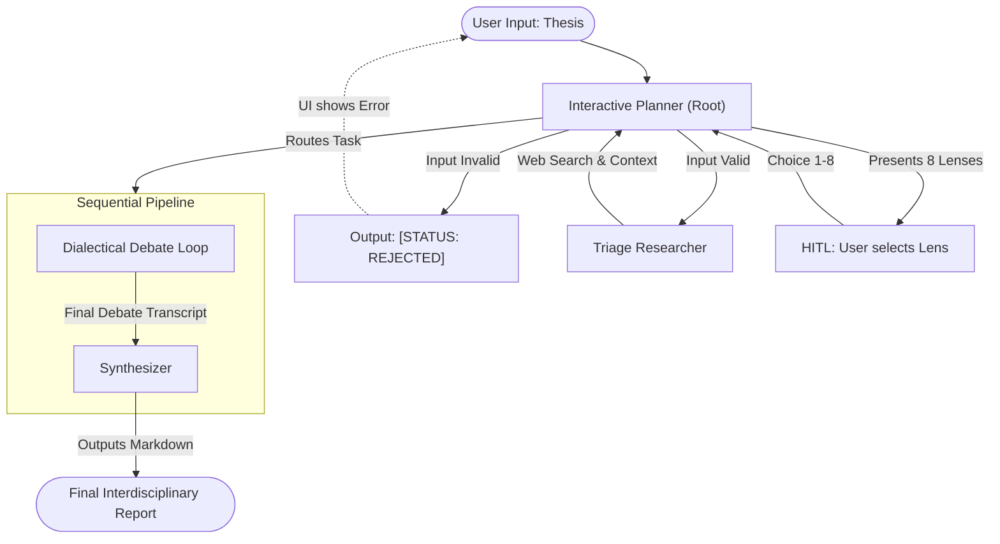
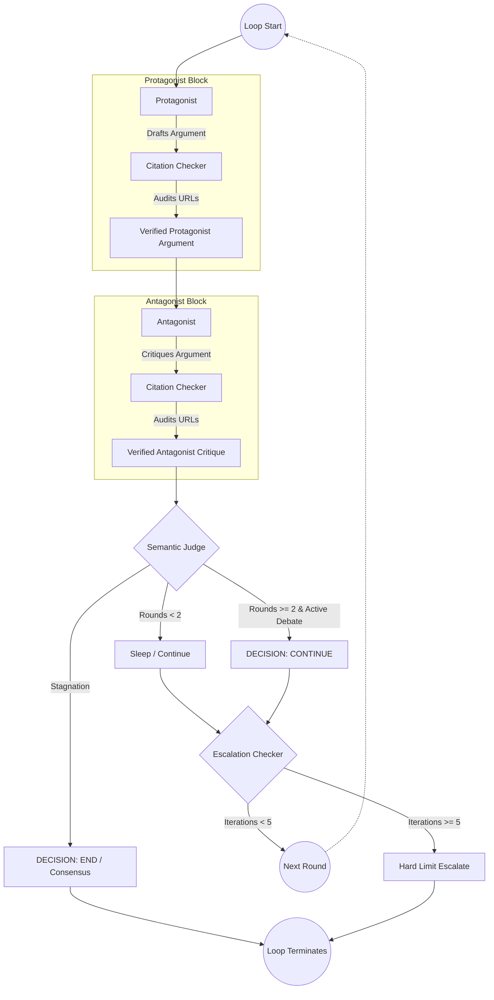
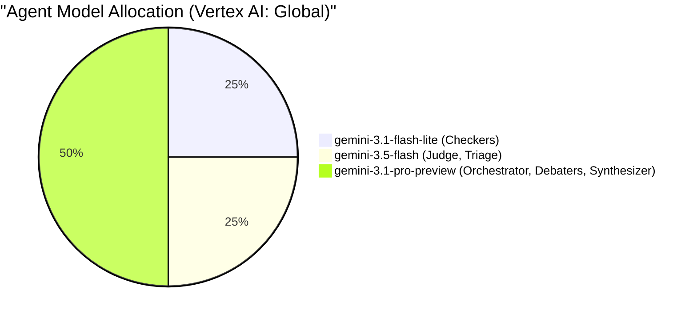

# Socratic Duel
*Two intellectual black belts, managed by their corners, stress-test your thesis in a disciplined debate.*

---

## The Problem
Standard Large Language Models (LLMs) suffer from **consensus bias**. When asked to evaluate complex arguments or theses, they typically default to generic, **middle-of-the-road summaries**. They blend viewpoints rather than testing them, producing output that **lacks academic rigor** and leaves critical methodological or empirical blind spots unchallenged. In addition to a tendency for **sycophancy**.

## The Solution
Socratic Duel is a multi-agent framework that replaces passive compliance with **adversarial debate**. Instead of defaulting to a safe consensus, it locks **specialized academic lenses**—such as The Empiricist or The Systems Theorist—into intellectual sparring. This friction ruthlessly exposes hidden biases, logical flaws, and empirical gaps, delivering a raw, **stress-tested audit** of your thesis.

## Core Values
* **Ground-Truth Anchoring:** Forces LLMs to argue from a chosen, unyielding worldview rather than defaulting to sycophantic, middle-of-the-road personas.
* **Zero-Trust Citation Auditing:** Deploys dedicated integrity agents to intercept drafts in real-time, verifying every URL, quote, and source citation to permanently purge hallucinations.
* **Cognitive Depth Attunement:** Automatically calibrates vocabulary, tone, and conceptual complexity to match a defined target audience—scaling seamlessly from a 15-year-old to a PhD-level researcher.
* **Stagnation Circuit-Breakers:** Employs a Semantic Judge to monitor the debate in real-time, killing the run the instant arguments stall or loop to eliminate token waste.

<br>
<div align="center">
<sub><i>Click the preview to watch the video on YouTube.</i></sub>
</div>
<p align="center">
        <a href="https://youtu.be/QCPbSbsgjVU">
          
  </a>
</p>

## How It Works

### High-Level Triage & Debate Pipeline
This diagram shows the end-to-end flow from the user's initial input to the final synthesized report, highlighting the Human-in-the-Loop (HITL) step.



* **1. Lens Selection:** You provide a thesis. The system presents **8 distinct epistemic lenses** (e.g., *The Empiricist*, *The Systems Theorist*) and recommends the optimal framework for your argument.
* **2. The Adversarial Loop:** A dynamically assigned **Protagonist** and **Contrarian** agent lock into an interactive reflection loop, aggressively debating your thesis from opposing academic strongholds.
* **3. The Synthesis:** A final **Synthesizer** agent distills the clash into a comprehensive, interdisciplinary report—mapping out your argument's methodological integrity alongside its deepest blind spots.

### Debate Loop (The Engine)
This diagram details the internal mechanics of the `LoopAgent`.



### Key Components & Agent Roles

* **The Match Commissioner (Interactive Planner):** Acts as the system orchestrator. Validates user input, deploys prompt injection defenses, triages the thesis via web search, and enforces a strict two-phase Human-In-The-Loop (HITL) protocol.
* **The Intellectual Black Belts (Adversarial Debaters):** Two highly specialized agents locked in a symmetric, multi-turn `LoopAgent` execution. To maintain absolute dialectical rigor, they are forced to validate every theoretical assertion with real-world, peer-reviewed data using the `search_semantic_scholar` tool.
* **The Cornermen (Citation Auditors):** Regulatory agents that intercept the Black Belts' drafts *before* they are committed to the transcript. Using the `verify_url_status` tool, they ping and parse every cited link. If a link is dead, hallucinated, or irrelevant, they reject the draft and trigger an error-correction loop, forcing the debater to find valid evidence or abandon the claim.
* **The Referee (Semantic Judge):** Oversees the entire bout. Evaluates the textual exchange against a strict logical grading rubric, dynamically tracks token state to prevent circular rhetoric, and exercises the authority to call a halt to the debate once a technical consensus or definitive breaking point is achieved.
* **The Cutman (Synthesizer):** Processes the raw, finalized debate transcript. Conducts meta-research on the interaction to author a mathematically clean, highly structured Markdown report, complete with an automated, dynamically generated Glossary of terms.

### Tri-Model Model Allocation


## 🚀 Core Features & Agentic Architecture
- **Tri-Model Optimization Strategy:** Intelligently routes tasks across Vertex AI to balance cost and reasoning depth. Employs `gemini-3.1-pro-preview` for the high-level debaters, `3.5-flash` for semantic judging, and parallel `flash-lite` models for rapid citation auditing.
- **Radical Hallucination Mitigation:** "Academic Integrity Auditors" intercept drafts and actively scrape every cited URL in real-time. If a link is dead, hallucinated, or empirically incorrect, the auditor silently scrubs it before the user ever sees it.
- **Dynamic Cognitive Profiling:** Automatically adapts the debate's vocabulary, tone, and conceptual depth based on a defined "Target Audience" complexity level (from 15-year-old to PhD).
- **Demo Mode:** An optional frontend toggle switch ("faster, less costly"). When enabled, the `DynamicGemini` model wrapper dynamically cascades models: `STRONG_MODEL` assignments route to `gemini-3.5-flash`, and `MID_MODEL` assignments route to `gemini-2.5-flash`, drastically cutting costs during testing.
- **Human-In-The-Loop Triage:** An Interactive Planner orchestrator that triages the thesis, strictly blocks prompt injections via ADK callbacks, and halts execution until you select 1 of 8 epistemic lenses (e.g., *The Ethicist*).
- **Finite Dialectical Loop:** A tightly controlled ADK `LoopAgent` pits a Protagonist against an Antagonist. A Semantic Judge can end the debate early if arguments stagnate, while an Escalation circuit-breaker enforces a hard limit of 5 iterations to prevent token explosion.
- **Interdisciplinary Synthesis:** A final Synthesizer agent conducts meta-research on the transcript, authoring a mathematically clean Markdown report complete with a dynamic glossary.
- **Global Cost Tracking:** A custom ADK App-level plugin intercepts every agent invocation to automatically tally token usage across the entire session, ensuring budget transparency.

## Project Structure

See the formal architecture and rule blueprint in [SPEC.md](SPEC.md).

```
epistemic-synth/
├── app/                       # Core Python backend
│   ├── agent.py               # Main agent logic & prompts
│   ├── fast_api_app.py        # FastAPI server entrypoint
│   ├── main.py                # App routing & middleware logic
│   └── app_utils/             # App utilities and helpers
├── frontend/                  # React + Vite frontend UI
├── tests/                     # Unit, integration, and load tests
├── SPEC.md                    # Formal architecture & agent rules
├── ROADMAP.md                 # Project roadmap and milestones
├── DIAGRAMS.md                # System architecture visual diagrams
├── GEMINI.md                  # AI-assisted development guide
├── Dockerfile                 # Multi-stage container deployment
└── pyproject.toml             # Python project dependencies
```

## Requirements

Before you begin, ensure you have:
- **uv**: Python package manager (used for all dependency management in this project). *Note: You do not need to install Python manually; `uv` will automatically download and install the correct Python version for you.* 
  - **Linux/macOS**: `curl -LsSf https://astral.sh/uv/install.sh | sh`
  - **Windows**: `powershell -ExecutionPolicy ByPass -c "irm https://astral.sh/uv/install.ps1 | iex"`
  - See full [Installation Instructions](https://docs.astral.sh/uv/getting-started/installation/)
- **agents-cli**: Agents CLI - Install with `uv tool install google-agents-cli`
- **Google Cloud SDK**: For GCP services - [Installation Instructions](https://cloud.google.com/sdk/docs/install)

### Authentication Setup

Before running the application, you must configure your environment variables by copying `.env.example` to a new `.env` file in the root directory:

```bash
cp .env.example .env
```

Open `.env` and configure your authentication using one of two methods:

- **Option A: Google Cloud / Vertex AI (Recommended)**
  - Ensure `GOOGLE_GENAI_USE_VERTEXAI=true` is set.
  - Fill in your `GOOGLE_CLOUD_PROJECT`.
  - Authenticate locally by running: `gcloud auth application-default login`
  
- **Option B: Google AI Studio API Key**
  - Comment out the Vertex AI settings in `.env`.
  - Uncomment the `GEMINI_API_KEY` line and paste your API key.


## Quick Start with Make (optional, but convenient)

If you want to automate installation, running both servers simultaneously, and deploying, you can use `make`. 
**Note:** `make` is completely optional. It's built for convenience but requires `make` to be installed on your system.

**Installing `make`:**
- **Windows (Chocolatey):** `choco install make` ([link](https://community.chocolatey.org/packages/make))
- **Windows (GnuWin32):** Download from [SourceForge](http://gnuwin32.sourceforge.net/packages/make.htm) or use `winget install GnuWin32.Make`
- **Linux (Ubuntu/Debian):** `sudo apt install make`
- **macOS:** Built-in, or install via `xcode-select --install`

**Available Make Commands:**
- `make install`: Installs both Python (`uv`) and Node (`npm`) dependencies.
- `make run`: Starts both the backend and frontend simultaneously.
- `make backend`: Starts only the FastAPI Python backend (useful for debugging in a dedicated terminal).
- `make frontend`: Starts only the React UI development server (useful for debugging in a dedicated terminal).
- `make deploy`: Automatically builds and deploys the Socratic Duel app to Google Cloud Run.
- `make undeploy`: Tears down the Google Cloud Run service.

## Quick Start (for the rest of us)

Install `agents-cli` and its skills if not already installed:

```bash
uvx google-agents-cli setup
```

Install required packages:

```bash
agents-cli install
```

Test the agent with a local webserver (raw agent only, no UI):

```bash
agents-cli playground
```

### Running the Full Application (Backend + Frontend)

1. **Start the FastAPI Backend:**
```bash
uv run uvicorn app.main:app --reload --reload-dir app
```
*(Note: We use `uvicorn` with an explicit `--reload-dir app` flag instead of `fastapi dev` to prevent Windows background tasks from triggering endless hot-reload loops by touching the `.venv` directory).*

2. **Start the React Frontend:**
```bash
cd frontend
npm install
npm run dev
```

## Deployment

You can deploy the application using the included Make target:

```bash
make deploy
```

Alternatively, you can deploy manually using `agents-cli`:

```bash
gcloud config set project <your-project-id>
agents-cli deploy
```
